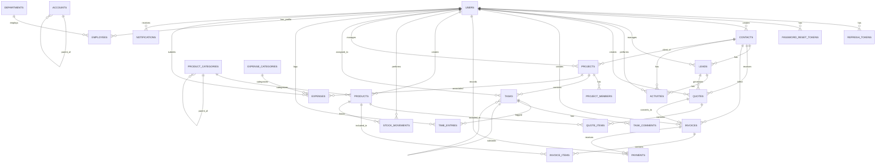

# BizFlow Database Schema

Database schema for BizFlow business management platform using DBML syntax.

```dbml
// ==============================================
// BIZFLOW DATABASE SCHEMA
// PostgreSQL 18 | ORM: Prisma
// ==============================================

Project BizFlow {
  database_type: 'PostgreSQL'
  Note: '''
    # BizFlow Database
    All-in-one business management platform for small businesses.
    Modules: Auth, CRM, Sales, Inventory, Projects, HR, Accounting
  '''
}

// ==============================================
// ENUMS
// ==============================================

Enum user_role {
  OWNER
  MANAGER
  EMPLOYEE
}

Enum contact_type {
  CUSTOMER
  SUPPLIER
}

Enum lead_stage {
  NEW
  QUALIFIED
  PROPOSAL
  WON
  LOST
}

Enum activity_type {
  CALL
  MEETING
  EMAIL
  NOTE
}

Enum quote_status {
  DRAFT
  SENT
  ACCEPTED
  REJECTED
  EXPIRED
}

Enum invoice_status {
  DRAFT
  SENT
  PAID
  OVERDUE
  CANCELLED
}

Enum stock_movement_type {
  STOCK_IN
  STOCK_OUT
  ADJUSTMENT
}

Enum project_status {
  ACTIVE
  ON_HOLD
  COMPLETED
  CANCELLED
}

Enum task_status {
  TODO
  IN_PROGRESS
  DONE
}

Enum task_priority {
  LOW
  MEDIUM
  HIGH
}

Enum expense_category {
  RENT
  UTILITIES
  SALARIES
  MARKETING
  TRAVEL
  OFFICE_SUPPLIES
  SOFTWARE
  EQUIPMENT
  OTHER
}

// ==============================================
// AUTHENTICATION & USERS
// ==============================================

Table organizations {
  id uuid [pk, default: `gen_random_uuid()`]
  name varchar(200) [not null]
  slug varchar(200) [unique, not null]
  created_at timestamp [default: `now()`]
  updated_at timestamp [default: `now()`]

  indexes {
    slug [unique]
  }

  Note: 'Tenant organization (e.g., Company)'
}

Table users {
  id uuid [pk, default: `gen_random_uuid()`]
  organization_id uuid [ref: > organizations.id, not null]
  email varchar(255) [unique, not null]
  password_hash varchar(255) [not null]
  first_name varchar(100) [not null]
  last_name varchar(100) [not null]
  role user_role [not null, default: 'EMPLOYEE']
  is_active boolean [default: true]
  is_email_verified boolean [default: false]
  avatar_url varchar(500)
  last_login_at timestamp
  created_at timestamp [default: `now()`]
  updated_at timestamp [default: `now()`]
  
  indexes {
    email [unique]
    organization_id
    role
    is_active
  }

  Note: 'System users scoped to an organization'
}

Table invitations {
  id uuid [pk, default: `gen_random_uuid()`]
  organization_id uuid [ref: > organizations.id, not null]
  email varchar(255) [not null]
  role user_role [not null, default: 'EMPLOYEE']
  token varchar(255) [unique, not null]
  expires_at timestamp [not null]
  invited_by_id uuid [ref: > users.id, not null]
  accepted_at timestamp
  created_at timestamp [default: `now()`]

  indexes {
    token [unique]
    (organization_id, email) [unique]
    expires_at
  }

  Note: 'Email invitations for joining an organization'
}

Table refresh_tokens {
  id uuid [pk, default: `gen_random_uuid()`]
  user_id uuid [ref: > users.id, not null]
  token varchar(500) [unique, not null]
  expires_at timestamp [not null]
  revoked boolean [default: false]
  created_at timestamp [default: `now()`]

  indexes {
    user_id
    token [unique]
    expires_at
  }

  Note: 'JWT refresh tokens for session management'
}

Table password_reset_tokens {
  id uuid [pk, default: `gen_random_uuid()`]
  user_id uuid [ref: > users.id, not null]
  token varchar(500) [unique, not null]
  expires_at timestamp [not null]
  used boolean [default: false]
  created_at timestamp [default: `now()`]

  indexes {
    user_id
    token [unique]
  }

  Note: 'Tokens for password reset functionality'
}

// ==============================================
// CRM MODULE
// ==============================================

Table contacts {
  id uuid [pk, default: `gen_random_uuid()`]
  organization_id uuid [ref: > organizations.id, not null]
  type contact_type [not null, default: 'CUSTOMER']
  company_name varchar(200)
  first_name varchar(100) [not null]
  last_name varchar(100) [not null]
  email varchar(255)
  phone varchar(50)
  address_line1 varchar(255)
  address_line2 varchar(255)
  city varchar(100)
  state varchar(100)
  postal_code varchar(20)
  country varchar(100)
  notes text
  is_active boolean [default: true]
  created_by uuid [ref: > users.id]
  created_at timestamp [default: `now()`]
  updated_at timestamp [default: `now()`]

  indexes {
    organization_id
    type
    email
    company_name
    (first_name, last_name)
    is_active
  }

  Note: 'Customer and supplier contacts'
}

Table leads {
  id uuid [pk, default: `gen_random_uuid()`]
  contact_id uuid [ref: > contacts.id, not null]
  title varchar(200) [not null]
  description text
  deal_value decimal(15,2)
  stage lead_stage [not null, default: 'NEW']
  expected_close_date date
  probability int [default: 0] // 0-100%
  assigned_to uuid [ref: > users.id]
  source varchar(100) // e.g., 'Website', 'Referral', 'Cold Call'
  lost_reason text
  won_at timestamp
  lost_at timestamp
  created_by uuid [ref: > users.id]
  created_at timestamp [default: `now()`]
  updated_at timestamp [default: `now()`]

  indexes {
    contact_id
    stage
    assigned_to
    expected_close_date
  }

  Note: 'Sales leads and opportunities pipeline'
}

Table activities {
  id uuid [pk, default: `gen_random_uuid()`]
  contact_id uuid [ref: > contacts.id]
  lead_id uuid [ref: > leads.id]
  type activity_type [not null]
  subject varchar(255) [not null]
  description text
  activity_date timestamp [not null]
  duration_minutes int
  performed_by uuid [ref: > users.id, not null]
  created_at timestamp [default: `now()`]
  updated_at timestamp [default: `now()`]

  indexes {
    contact_id
    lead_id
    type
    activity_date
    performed_by
  }

  Note: 'Activity logging for contacts and leads (calls, meetings, emails)'
}

// ==============================================
// SALES MODULE
// ==============================================

Table quotes {
  id uuid [pk, default: `gen_random_uuid()`]
  quote_number varchar(50) [unique, not null]
  contact_id uuid [ref: > contacts.id, not null]
  lead_id uuid [ref: > leads.id]
  status quote_status [not null, default: 'DRAFT']
  issue_date date [not null]
  expiry_date date
  subtotal decimal(15,2) [not null, default: 0]
  tax_rate decimal(5,2) [default: 0]
  tax_amount decimal(15,2) [default: 0]
  discount_amount decimal(15,2) [default: 0]
  total decimal(15,2) [not null, default: 0]
  notes text
  terms_and_conditions text
  created_by uuid [ref: > users.id]
  sent_at timestamp
  created_at timestamp [default: `now()`]
  updated_at timestamp [default: `now()`]

  indexes {
    quote_number [unique]
    contact_id
    status
    issue_date
  }

  Note: 'Customer quotes/proposals'
}

Table quote_items {
  id uuid [pk, default: `gen_random_uuid()`]
  quote_id uuid [ref: > quotes.id, not null]
  product_id uuid [ref: > products.id]
  description varchar(500) [not null]
  quantity decimal(10,2) [not null, default: 1]
  unit_price decimal(15,2) [not null]
  discount_percent decimal(5,2) [default: 0]
  total decimal(15,2) [not null]
  sort_order int [default: 0]
  created_at timestamp [default: `now()`]

  indexes {
    quote_id
    product_id
  }

  Note: 'Line items for quotes'
}

Table invoices {
  id uuid [pk, default: `gen_random_uuid()`]
  invoice_number varchar(50) [unique, not null]
  contact_id uuid [ref: > contacts.id, not null]
  quote_id uuid [ref: > quotes.id] // If converted from quote
  status invoice_status [not null, default: 'DRAFT']
  issue_date date [not null]
  due_date date [not null]
  subtotal decimal(15,2) [not null, default: 0]
  tax_rate decimal(5,2) [default: 0]
  tax_amount decimal(15,2) [default: 0]
  discount_amount decimal(15,2) [default: 0]
  total decimal(15,2) [not null, default: 0]
  amount_paid decimal(15,2) [default: 0]
  amount_due decimal(15,2) [not null, default: 0]
  notes text
  terms_and_conditions text
  created_by uuid [ref: > users.id]
  sent_at timestamp
  paid_at timestamp
  created_at timestamp [default: `now()`]
  updated_at timestamp [default: `now()`]

  indexes {
    invoice_number [unique]
    contact_id
    status
    issue_date
    due_date
  }

  Note: 'Customer invoices for billing'
}

Table invoice_items {
  id uuid [pk, default: `gen_random_uuid()`]
  invoice_id uuid [ref: > invoices.id, not null]
  product_id uuid [ref: > products.id]
  description varchar(500) [not null]
  quantity decimal(10,2) [not null, default: 1]
  unit_price decimal(15,2) [not null]
  discount_percent decimal(5,2) [default: 0]
  total decimal(15,2) [not null]
  sort_order int [default: 0]
  created_at timestamp [default: `now()`]

  indexes {
    invoice_id
    product_id
  }

  Note: 'Line items for invoices'
}

Table payments {
  id uuid [pk, default: `gen_random_uuid()`]
  invoice_id uuid [ref: > invoices.id, not null]
  payment_date date [not null]
  amount decimal(15,2) [not null]
  payment_method varchar(50) // e.g., 'Cash', 'Bank Transfer', 'Credit Card'
  reference varchar(100) // Transaction reference
  notes text
  recorded_by uuid [ref: > users.id]
  created_at timestamp [default: `now()`]

  indexes {
    invoice_id
    payment_date
  }

  Note: 'Payment records for invoices (supports partial payments)'
}

// ==============================================
// INVENTORY MODULE
// ==============================================

Table product_categories {
  id uuid [pk, default: `gen_random_uuid()`]
  name varchar(100) [unique, not null]
  description text
  parent_id uuid [ref: > product_categories.id] // For nested categories
  is_active boolean [default: true]
  created_at timestamp [default: `now()`]
  updated_at timestamp [default: `now()`]

  indexes {
    name [unique]
    parent_id
    is_active
  }

  Note: 'Product categories for organization'
}

Table products {
  id uuid [pk, default: `gen_random_uuid()`]
  organization_id uuid [ref: > organizations.id, not null]
  sku varchar(100) [not null]
  name varchar(200) [not null]
  description text
  category_id uuid [ref: > product_categories.id]
  sale_price decimal(15,2) [not null]
  cost_price decimal(15,2)
  stock_quantity int [not null, default: 0]
  low_stock_threshold int [default: 10]
  unit varchar(50) [default: 'unit'] // e.g., 'unit', 'kg', 'liter'
  is_active boolean [default: true]
  image_url varchar(500)
  barcode varchar(100)
  created_by uuid [ref: > users.id]
  created_at timestamp [default: `now()`]
  updated_at timestamp [default: `now()`]

  indexes {
    (organization_id, sku) [unique]
    name
    category_id
    is_active
    stock_quantity
  }

  Note: 'Product catalog with stock tracking'
}

Table stock_movements {
  id uuid [pk, default: `gen_random_uuid()`]
  product_id uuid [ref: > products.id, not null]
  type stock_movement_type [not null]
  quantity int [not null] // Positive for in, negative for out
  quantity_before int [not null]
  quantity_after int [not null]
  reference varchar(100) // e.g., 'Invoice #123', 'Purchase Order #456'
  notes text
  movement_date timestamp [not null, default: `now()`]
  performed_by uuid [ref: > users.id, not null]
  created_at timestamp [default: `now()`]

  indexes {
    product_id
    type
    movement_date
    performed_by
  }

  Note: 'Stock in/out movement history'
}

// ==============================================
// PROJECTS MODULE
// ==============================================

Table projects {
  id uuid [pk, default: `gen_random_uuid()`]
  organization_id uuid [ref: > organizations.id, not null]
  name varchar(200) [not null]
  description text
  status project_status [not null, default: 'ACTIVE']
  start_date date
  deadline date
  budget decimal(15,2)
  actual_cost decimal(15,2) [default: 0]
  progress_percent int [default: 0] // 0-100
  contact_id uuid [ref: > contacts.id] // Client/Customer
  manager_id uuid [ref: > users.id]
  created_by uuid [ref: > users.id]
  completed_at timestamp
  created_at timestamp [default: `now()`]
  updated_at timestamp [default: `now()`]

  indexes {
    organization_id
    status
    manager_id
    deadline
    contact_id
  }

  Note: 'Projects with tasks and time tracking'
}

Table project_members {
  id uuid [pk, default: `gen_random_uuid()`]
  project_id uuid [ref: > projects.id, not null]
  user_id uuid [ref: > users.id, not null]
  role varchar(50) [default: 'Member'] // e.g., 'Manager', 'Member', 'Viewer'
  joined_at timestamp [default: `now()`]

  indexes {
    (project_id, user_id) [unique]
  }

  Note: 'Project team members'
}

Table tasks {
  id uuid [pk, default: `gen_random_uuid()`]
  project_id uuid [ref: > projects.id, not null]
  title varchar(200) [not null]
  description text
  status task_status [not null, default: 'TODO']
  priority task_priority [not null, default: 'MEDIUM']
  due_date date
  estimated_hours decimal(6,2)
  actual_hours decimal(6,2) [default: 0]
  assignee_id uuid [ref: > users.id]
  parent_task_id uuid [ref: > tasks.id] // For subtasks
  sort_order int [default: 0]
  completed_at timestamp
  created_by uuid [ref: > users.id]
  created_at timestamp [default: `now()`]
  updated_at timestamp [default: `now()`]

  indexes {
    project_id
    status
    priority
    assignee_id
    due_date
    parent_task_id
  }

  Note: 'Project tasks with assignment and status tracking'
}

Table task_comments {
  id uuid [pk, default: `gen_random_uuid()`]
  task_id uuid [ref: > tasks.id, not null]
  user_id uuid [ref: > users.id, not null]
  content text [not null]
  created_at timestamp [default: `now()`]
  updated_at timestamp [default: `now()`]

  indexes {
    task_id
    created_at
  }

  Note: 'Comments on tasks for team collaboration'
}

Table time_entries {
  id uuid [pk, default: `gen_random_uuid()`]
  task_id uuid [ref: > tasks.id, not null]
  user_id uuid [ref: > users.id, not null]
  date date [not null]
  hours decimal(6,2) [not null]
  description text
  is_billable boolean [default: true]
  hourly_rate decimal(10,2) // For billing calculations
  created_at timestamp [default: `now()`]
  updated_at timestamp [default: `now()`]

  indexes {
    task_id
    user_id
    date
    is_billable
  }

  Note: 'Time logging for tasks (hours worked)'
}

// ==============================================
// HR MODULE
// ==============================================

Table departments {
  id uuid [pk, default: `gen_random_uuid()`]
  organization_id uuid [ref: > organizations.id, not null]
  name varchar(100) [not null]
  description text
  manager_id uuid [ref: > users.id]
  is_active boolean [default: true]
  created_at timestamp [default: `now()`]
  updated_at timestamp [default: `now()`]

  indexes {
    (organization_id, name) [unique]
    manager_id
    is_active
  }

  Note: 'Company departments/teams'
}

Table employees {
  id uuid [pk, default: `gen_random_uuid()`]
  user_id uuid [ref: > users.id, unique, not null]
  department_id uuid [ref: > departments.id]
  employee_number varchar(50) [unique]
  job_title varchar(100)
  phone varchar(50)
  address text
  hire_date date [not null]
  termination_date date
  salary decimal(15,2)
  employment_type varchar(50) [default: 'Full-time'] // 'Full-time', 'Part-time', 'Contractor'
  is_active boolean [default: true]
  emergency_contact_name varchar(200)
  emergency_contact_phone varchar(50)
  created_at timestamp [default: `now()`]
  updated_at timestamp [default: `now()`]

  indexes {
    user_id [unique]
    department_id
    employee_number [unique]
    is_active
    hire_date
  }

  Note: 'Employee profiles linked to user accounts'
}

// ==============================================
// ACCOUNTING MODULE
// ==============================================

Table expense_categories {
  id uuid [pk, default: `gen_random_uuid()`]
  organization_id uuid [ref: > organizations.id, not null]
  name varchar(100) [not null]
  description text
  type expense_category [not null]
  is_active boolean [default: true]
  created_at timestamp [default: `now()`]
  updated_at timestamp [default: `now()`]

  indexes {
    (organization_id, name) [unique]
    type
    is_active
  }

  Note: 'Expense categorization for accounting'
}

Table expenses {
  id uuid [pk, default: `gen_random_uuid()`]
  category_id uuid [ref: > expense_categories.id, not null]
  amount decimal(15,2) [not null]
  expense_date date [not null]
  description varchar(500) [not null]
  vendor varchar(200)
  reference varchar(100) // e.g., receipt number
  receipt_url varchar(500)
  project_id uuid [ref: > projects.id] // Optional project association
  is_reimbursable boolean [default: false]
  is_reimbursed boolean [default: false]
  submitted_by uuid [ref: > users.id, not null]
  approved_by uuid [ref: > users.id]
  approved_at timestamp
  created_at timestamp [default: `now()`]
  updated_at timestamp [default: `now()`]

  indexes {
    category_id
    expense_date
    submitted_by
    project_id
    is_reimbursable
  }

  Note: 'Business expense records'
}

Table accounts {
  id uuid [pk, default: `gen_random_uuid()`]
  organization_id uuid [ref: > organizations.id, not null]
  code varchar(20) [not null]
  name varchar(100) [not null]
  type varchar(50) [not null] // 'Asset', 'Liability', 'Equity', 'Revenue', 'Expense'
  description text
  parent_id uuid [ref: > accounts.id] // For chart of accounts hierarchy
  balance decimal(15,2) [default: 0]
  is_active boolean [default: true]
  created_at timestamp [default: `now()`]
  updated_at timestamp [default: `now()`]

  indexes {
    (organization_id, code) [unique]
    type
    parent_id
    is_active
  }

  Note: 'Chart of accounts for basic accounting'
}

// ==============================================
// SYSTEM / AUDIT
// ==============================================

Table audit_logs {
  id uuid [pk, default: `gen_random_uuid()`]
  user_id uuid [ref: > users.id]
  action varchar(50) [not null] // 'CREATE', 'UPDATE', 'DELETE', 'LOGIN', 'LOGOUT'
  entity_type varchar(100) [not null] // e.g., 'Contact', 'Invoice', 'Product'
  entity_id uuid [not null]
  old_values jsonb
  new_values jsonb
  ip_address varchar(45)
  user_agent varchar(500)
  created_at timestamp [default: `now()`]

  indexes {
    user_id
    entity_type
    entity_id
    action
    created_at
  }

  Note: 'System audit trail for tracking changes'
}

Table notifications {
  id uuid [pk, default: `gen_random_uuid()`]
  user_id uuid [ref: > users.id, not null]
  type varchar(50) [not null] // 'LOW_STOCK', 'INVOICE_OVERDUE', 'TASK_DUE', etc.
  title varchar(200) [not null]
  message text
  is_read boolean [default: false]
  entity_type varchar(100)
  entity_id uuid
  created_at timestamp [default: `now()`]

  indexes {
    user_id
    is_read
    type
    created_at
  }

  Note: 'User notifications and alerts'
}

Table settings {
  id uuid [pk, default: `gen_random_uuid()`]
  organization_id uuid [ref: > organizations.id, not null]
  key varchar(100) [not null]
  value jsonb [not null]
  description text
  updated_by uuid [ref: > users.id]
  created_at timestamp [default: `now()`]
  updated_at timestamp [default: `now()`]

  indexes {
    (organization_id, key) [unique]
  }

  Note: 'Application settings and configuration'
}
```

## Entity Relationship Diagram



## Table Summary

| Module | Tables | Description |
|--------|--------|-------------|
| **Auth** | `users`, `refresh_tokens`, `password_reset_tokens` | User authentication and session management |
| **CRM** | `contacts`, `leads`, `activities` | Customer relationship management |
| **Sales** | `quotes`, `quote_items`, `invoices`, `invoice_items`, `payments` | Quote-to-cash workflow |
| **Inventory** | `product_categories`, `products`, `stock_movements` | Product catalog and stock tracking |
| **Projects** | `projects`, `project_members`, `tasks`, `task_comments`, `time_entries` | Project and task management |
| **HR** | `departments`, `employees` | Employee directory and organization |
| **Accounting** | `expense_categories`, `expenses`, `accounts` | Expense tracking and basic accounting |
| **System** | `audit_logs`, `notifications`, `settings` | Audit trail, alerts, and configuration |

**Total Tables: 26**
